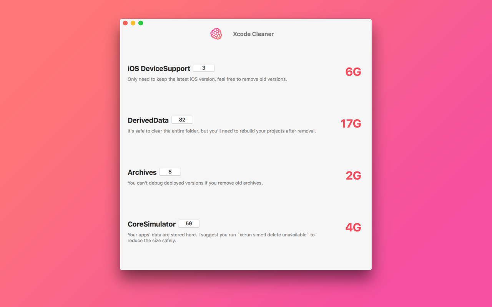

# Cleaner for Xcode

This app helps you to make your Xcode faster by removing unwanted and deprecated files.

You can run cleaner weekly or monthly to keep your developer folder health and to save more disk space.

这个应用可以帮助你清除遗留以及废弃文件，从而极大的节省硬盘空间. 你可以每月或者每周运行一次进行清理。

## Download

Cleaner for Xcode is available on Mac App Store now, you can get it using the link below. You can also build it by yourself, please refer to `Build` section.

## Build

Make sure you have latest `node` and `npm or yarn`  and `watchman` installed, you can install them using `homebrew`

1. Run `npm install` or `yarn` in project directory.
2. Run `open macos/XcodeCleaner.xcodeproj` to open Xcode project.
3. Disable `App Sandbox` in target's `Capabilities`.
4. Run!

----

## My Products

#### HyperApp: The App Store for Linux / Linux 一键部署工具，包含数十个应用

[HyperApp on  AppStore](https://itunes.apple.com/app/apple-store/id1179750280?pt=118260435&ct=xc&mt=8)

#### Ping: Monitor Linux servers on your phone / Linux 监控工具

[Ping on  AppStore](https://itunes.apple.com/app/apple-store/id1276204653?pt=118260435&ct=xc)

#### Cloud Speed: One tap to test speed of cloud hosting servers / 全球VPS一键测速
[Ping on  AppStore](https://itunes.apple.com/app/apple-store/id1299527944?pt=118260435&ct=xc&mt=8)

## FAQ

#### 中国用户可能遇到的编译问题 (for Chinese users)

npm/yarn 安装过程会在 npmjs.com 下载库，这个网络会比较慢。编译过程中会去 github 和 sourceforge 下载依赖库。所以你需要一个系统全局的科学上网环境。
